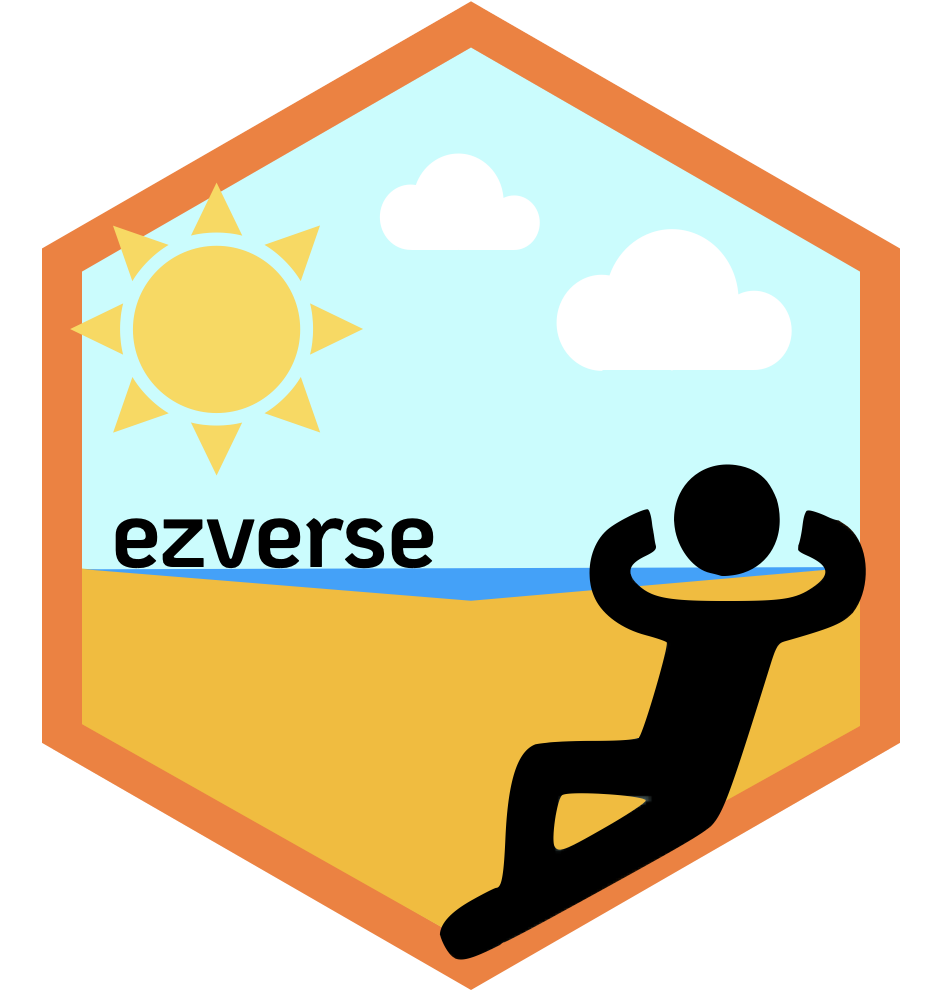

# Welcome 👋

Welcome 🐙 ! Thanks for checking me out. **Before you move on**, there’s one important
thing you should know…

 <!--

-->

That said, if you have any questions, want to collaborate on a project,
or find an issue with my code, feel free to submit an issue in GitHub or
hit me up at any of the following:

- [LinkedIn](https://www.linkedin.com/in/ericjlamphere/) - I’m relatively active on linkedIn
- [Email](mailto:ericjlamphere@gmail.com) - Most likely to get a response

# Projects 🤖

This doesn't cover all of my repos, just a handful of some of the slightly more polished projects

### ezverse <a href='https://github.com/EricLamphere/ezverse'></a>

<!-- badges: start -->

[](https://lifecycle.r-lib.org/articles/stages.html#maturing)
[](https://github.com/EricLamphere/ezverse/actions/workflows/check-release.yaml)
[](https://CRAN.R-project.org/package=ezverse)
<!-- badges: end -->

A collection of packages (all prefixed with ‘ez’) that
are supposed to make various aspects of data science and analytics
engineering much ~~ez~~easier. Current state looks like this:

- [**ezverse**](https://github.com/EricLamphere/ezverse.git) - Easily install and load all of the `ezverse` packages
- [**ezxfig**](https://github.com/EricLamphere/ezxfig.git) - Easily transform data frames
  - “xfig” comes from the word “transfigure”, meaning “transform into
    something more beautiful or elevated”. Kind of lame but I liked it
- [**ezexplore**](https://github.com/EricLamphere/ezexplore.git) - Easily explore data sets and produce summary statistics
- [**ezviz**](https://github.com/EricLamphere/ezviz.git) - Easily configure `formattable` tables for aesthetically pleasing table output
- [**ezextras**](https://github.com/EricLamphere/ezextras.git) - Intuitive, easy to use helper functions to make for faster development and more readable code

Similar to the `tidyverse`, you can install and load all of the
`ezverse` packages with:

``` r
remotes::install_github("EricLamphere/ezverse")
```

### Database Server

The big idea: Set up my own server on a Raspberry Pi that I can use as a central database for all of my future projects. I've started a project with clickhouse but I haven't landed on that as my platform of choice yet. 

- 🍋
  [**clickhouse-db**](https://github.com/EricLamphere/clickhouse-db.git) -
  ClickHouse database that could be used as the database for future
  projects. I don’t have any experience with ClickHouse or Airflow, so I
  wanted to see if I could get those things working together in a docker
  container.
  - Database: ClickHouse
  - Orchestration: Airflow
  - ETL & ELT: dbt
  - Packaging: Docker

### Apps <a href='https://github.com/rstudio/shiny'></a>

- 🏖️ [**survivor**](https://github.com/EricLamphere/survivor.git) - R
  Shiny app for keeping track of the survivor pool that I set up with my
  family and friends. You can use it too if you clone the repo and point
  to your own google sheet.
- 🏡[**house-shopping**](https://github.com/EricLamphere/house-shopping.git) - App built with Claude to help me organize and save all of the houses I'm considering buying. It's meant to be run locally and stores it's memory in the `memory/` dir within the repo. Clone it and run `task start` to try it yourself.
