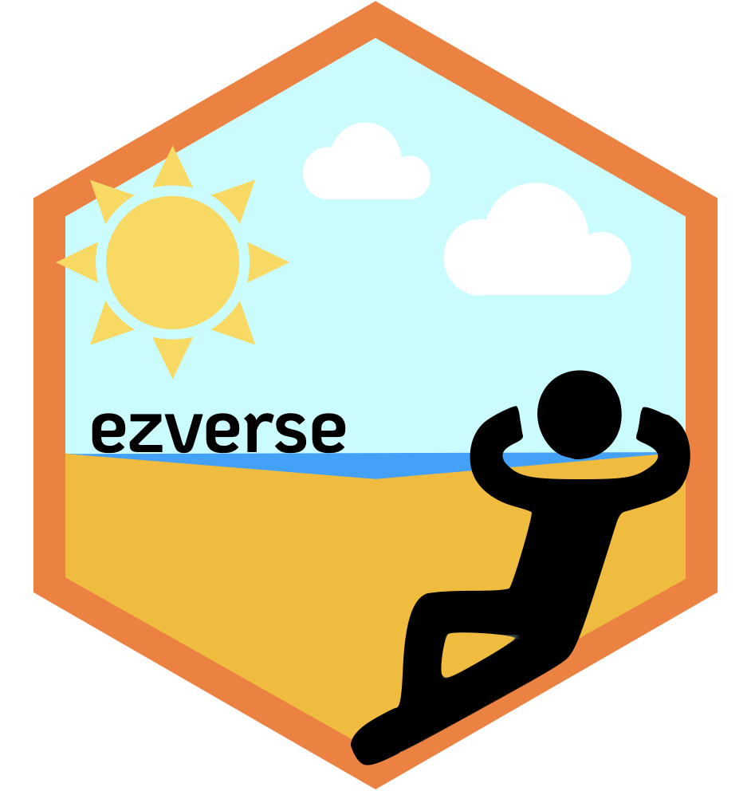

# Welcome 👋

Hayo, welcome to my GitHub 🐙 ! Here you’ll find a myriad of random
things I’m working on, so feel free to sleuth 🕵 around. **Before you
move on**, here’s one very important thing you should know first…

 <!--

-->

That said, if you have any questions, want to use some of my code, or
find a problem, feel free to submit an issue in GitHub or hit me up at
any of the following:

-   [LinkedIn](https://www.linkedin.com/in/ericjlamphere/) - I’m
    relatively active on linkedIn, so if we work together on something,
    let’s connect
-   [Email](ericjlamphere@gmail.com) - Most likely to get a response
-   [Twitter](https://twitter.com/ericlamphere) - I don’t really use
    this a ton, but you can send me cool things or questions here and
    I’ll see them eventually

# Projects 🤖

I don’t have a ton in here currently, but the future is bright for these
repos. Here’s a quick overview of the projects I’m working on.

### ezverse <a href='https://github.com/EricLamphere/ezverse'></a>

<!-- badges: start -->

[](https://lifecycle.r-lib.org/articles/stages.html#maturing)
[](https://github.com/EricLamphere/ezverse/actions/workflows/check-release.yaml)
[](https://CRAN.R-project.org/package=ezverse)
<!-- badges: end -->

I’m working on a collection of packages (all prefixed with ‘ez’) that
are supposed to make various aspects of data science, automated
reporting, and data exploration much easier (ez… get it?). Current state
looks like this:

-   [**ezxfig**](https://github.com/EricLamphere/ezxfig.git) - Easily
    transform data frames
    -   “xfig” comes from the word “transfigure”, meaning “transform
        into something more beautiful or elevated”. Kind of lame but I
        liked it, and ezxfig sort of rolls off the tongue
-   [**ezexplore**](https://github.com/EricLamphere/ezexplore.git) -
    Easily explore data sets and produce summary statistics
-   [**ezdates**](https://github.com/EricLamphere/ezdates.git) - Easily
    manipulate dates and define date ranges
-   [**ezviz**](https://github.com/EricLamphere/ezviz.git) - Easily
    configure `formattable` tables for aesthetically pleasing table
    output
-   [**ezextras**](https://github.com/EricLamphere/ezextras.git) -
    Easily… idk but these certainly make coding quicker

Similar to the `tidyverse`, you can install and load all of the
`ezverse` packages with:

``` r
remotes::install_github("EricLamphere/ezverse")
```

### Shiny Apps <a href='https://github.com/rstudio/shiny'></a>

-   Note: These are the RStudio Shiny badges & logo, not mine.

<!-- badges: start -->

[](https://CRAN.R-project.org/package=shiny)
[](https://github.com/rstudio/shiny/actions)
[](https://community.rstudio.com/new-topic?category=shiny&tags=shiny)
<!-- badges: end -->

I haven’t really done anything with this yet, but I’m planning on
creating multilple shiny apps, one of which visualizes and summarizes
data out of the census API

### Lamps

(need a good hex sticker for this.. and some badges)

This repo is just for random projects and analyses that I work on.
There’s nothing in there currently except for some code that I
transfered into the `ezverse`
